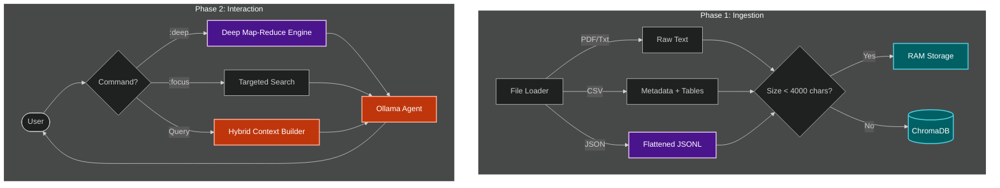

# 🧠 Local File Intelligence

A powerful, offline **RAG (Retrieval-Augmented Generation)** system that lets you chat with your local documents. It uses a **Hybrid Architecture** to handle both small summaries and massive reports with high precision.

> **Privacy First:** 100% Local. No data leaves your machine. Powered by [Ollama](https://ollama.com/).

## 🚀 Key Features

* **Hybrid Retrieval Engine:**
    * **RAM Mode:** Small files are kept in memory for 100% accuracy and zero latency.
    * **Vector Mode:** Large files (>4000 chars) are automatically chunked and indexed in **ChromaDB** for scalable semantic search.
* **Multi-Format Intelligence:**
    * 📄 **PDFs:** Extracts text and parses structure.
    * 📊 **CSVs:** Auto-calculates row counts and formats data into readable Markdown tables.
    * 🗄️ **NoSQL/JSON:** Flattens nested JSON data into analyze-able records (great for logs & mongo dumps).
* **🧠 Deep Summarizer (Map-Reduce):**
    * Can summarize massive documents (500+ pages) by breaking them down, summarizing chunks, and combining them into a master report.
* **Interactive CLI:**
    * **Focus Mode:** Lock the chat to a specific file to eliminate noise.
    * **Session Recorder:** Save your entire analysis to a `.txt` report.

## 🏗️ Architecture



🛠️ Installation

### Prerequisites
- Python 3.10+
- Ollama installed and running (if using the included Ollama agent)
- Git

### 1. Clone the repository
# 🧠 Local File Intelligence

A powerful, offline **RAG (Retrieval-Augmented Generation)** system that lets you chat with your local documents. It uses a **Hybrid Architecture** to handle both small summaries and massive reports with high precision.

> **Privacy First:** 100% Local. No data leaves your machine. Powered by [Ollama](https://ollama.com/).

## 🚀 Key Features

- **Hybrid Retrieval Engine:**
  - **RAM Mode:** Small files are kept in memory for 100% accuracy and zero latency.
  - **Vector Mode:** Large files (>4000 chars) are automatically chunked and indexed in **ChromaDB** for scalable semantic search.
- **Multi-Format Intelligence:**
  - 📄 **PDFs:** Extracts text and parses structure.
  - 📊 **CSVs:** Auto-calculates row counts and formats data into readable Markdown tables.
  - 🗄️ **NoSQL/JSON:** Flattens nested JSON data into analyze-able records (great for logs & mongo dumps).
- **🧠 Deep Summarizer (Map-Reduce):**
  - Can summarize massive documents (500+ pages) by breaking them down, summarizing chunks, and combining them into a master report.
- **Interactive CLI:**
  - **Focus Mode:** Lock the chat to a specific file to eliminate noise.
  - **Session Recorder:** Save your entire analysis to a `.txt` report.
### 4. Pull the model (if using Ollama)
Ensure Ollama is running, then pull the default model (for example Llama 3):
```bash
ollama pull llama3
```

## 🖥️ Usage

1. Prepare data: place your documents (PDF, CSV, JSON, TXT) under the `data/` folder.
2. Run the CLI:
```bash
python main.py --files ./data
```

## 🎮 CLI Commands
- `files` : List all loaded files and their storage status (RAM vs Vector).
- `:focus [filename]` : Lock the chat to a specific file (e.g., `:focus sales.csv`).
- `:deep [filename]` : Run a Deep Map-Reduce summary on a large document.
- `:save [name]` : Export the current chat history to a text file.
- `:all` : Return to global search mode (search all files).
- `exit` : Quit the application.

## 📂 Project Structure

local_file_intelligence/
├── core/
│   ├── agent.py            # LLM Interaction Handler
│   ├── hybrid_manager.py   # Router for RAM vs Vector DB
│   └── summarizer.py       # Map-Reduce Engine for large docs
├── utils/
│   ├── file_loader.py      # Parsers for PDF, CSV, JSON
│   ├── chunker.py          # Semantic Text Splitter
│   └── vector_store.py     # ChromaDB wrapper
├── data/                   # Your documents go here
├── main.py                 # CLI Entry Point
├── requirements.txt        # Dependencies
├── LICENSE                 # MIT License
└── README.md               # Documentation

## 🤝 Contributing
Contributions are welcome!

1. Fork the project
2. Create your feature branch: `git checkout -b feature/AmazingFeature`
3. Commit your changes: `git commit -m 'Add some AmazingFeature'`
4. Push to the branch: `git push origin feature/AmazingFeature`
5. Open a Pull Request

## 📜 License
Distributed under the MIT License. See LICENSE for more information.
